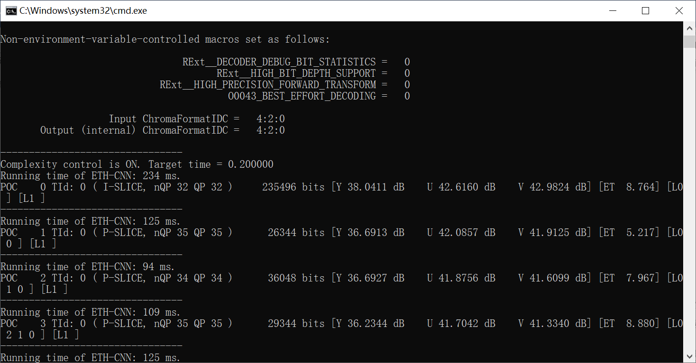
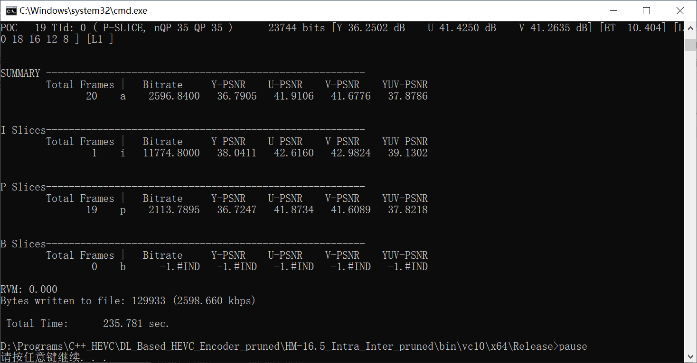

# Deep Learning Based HM Encoder (Accelerated ETH-CNN)

This program is the deep learning based fast HM encoder [1] [link](https://ieeexplore.ieee.org/abstract/document/9126122) with accelerated ETH-CNN models.

In [2] [link](https://ieeexplore.ieee.org/abstract/document/8384310), we have proposed a deep ETH-CNN based approach to early predict the CU partition for HEVC, which can drastically save the encoding time via skipping the RDO search in redundant CUs. After [2] was published, we also found that the ETH-CNN itself can be further accelerated for more practical use. So, an acceleration approach for ETH-CNN is proposed in [1] with network pruning. As verified in the experiments, the CU partition of 1080p frames can be predicted in real time @30fps+, while keeping the RD performance.

This encoder is modified from the standard HM 16.5, coded with C++. When the encoder is running, it calls the pruned ETH-CNN models for fast predicting the CU partition. The models were trained with Python 3.6 and TensorFlow 1.12 in advance, and then the codes for ETH-CNN inference were encrypted in a DLL file *ETH-CNN_WinDLL.dll*.

## Download

Dropbox: https://drive.google.com/file/d/1-bJFScVBUA7Q7IvQyeMv4rXKneXa3Z6g/view?usp=sharing

BaiduNetDisk: https://pan.baidu.com/s/1CPPQdElwhDPHPoi6tDByyA (code: m15i)

## Source

In HM 16.5, four C++ files have been modified:

- source\Lib\TLibCommon\TComPic.h  (set decision thresholds and split probabilities to each frame)
- source\Lib\TLibEncoder\TEncGOP.cpp  (main pipeline for encoding all frames)
- source\Lib\TLibEncoder\TEncSearch.cpp  (generate residual frames during pre-encoding)
- source\Lib\TLibEncoder\TEncCu.cpp  (skip redundant CUs)

Another two files have been added:

- source\Lib\TLibEncoder\ETH-CNN_WinDLL.h  (define classes and functions to be used)
- source\Lib\TLibEncoder\ETH-CNN_WinDLL.lib  (static link library)

For more details, please refer to the comments in these source codes.

## Running

2. Path into *bin\vc10\x64\Release*

2. Set upper/lower thresholds for the three-level CU partition in file *Thr_info.txt*
  
	Format: 
  
	```
    B_SLICE up_level1 down_level1 up_level2 down_level2 up_level3 down_level3
    P_SLICE up_level1 down_level1 up_level2 down_level2 up_level3 down_level3
    I_SLICE up_level1 down_level1 up_level2 down_level2 up_level3 down_level3
   ```

    Example: 
   
    ```
    B_SLICE 0.6 0.4 0.7 0.3 0.8 0.2
    P_SLICE 0.6 0.4 0.7 0.3 0.8 0.2
    I_SLICE   1   0   1   0   1   0
    ```

3. Edit *Cfg_para.txt* to set some parameters. 

	Format:
	
    ```
	String1 String2 String3
    ```

	- String1 selects the coding configuration, which can be chosen from *AI*, *LDP*, *LDB* or *RA*.
	
	- String2 decides whether to enable complexity control of ETH-CNN, chosen from *NoControl* or *Control*.
	
	- String3 is only necessary when complexity control is enabled, deciding the target running time chosen in [0.045, 1.0]. This value represents the relative running time of a pruned ETH-CNN model compared over the running time of full ETH-CNN model.
	
	Example:
	
	```
	LDP Control 0.2
	```

5. - If without complexity control, please specify the models to be used, by copying the folder *model_qp22~37_Intra/Inter_ratio(value)* as *model_qp22~37_Intra/Inter*. Here, the value in the end of a folder name is the retention ratio of trainable parameters, chosen from {1.0, 0.2, 0.05, 0.01, 0.005, 0.002, 0.001}. A larger value means that more parameters are kept un-pruned with higher prediction accuracy of ETH-CNN, and vice versa. As a result, one model for intra-mode and one model for inter-mode are specified. 

     

   - If with complexity control, simply skip this step, because the modified HM encoder can automatically select the models.

6. Run *TAppEncoder.exe* on Windows 10. (Program for Linux is to be uploaded soon)

   Examples: *run_AI.bat*, *run_LDP.bat*, *run_LDB.bat*, *run_RA.bat*

   If the program is normally run, you will see the process like this.






## References

[1] T. Li, M. Xu, X. Deng and L. Shen, "Accelerate CTU Partition to Real Time for HEVC Encoding with Complexity Control," in *IEEE Transactions on Image Processing* (TIP), Early Access 2020.

[2] M. Xu, T. Li, Z. Wang, X. Deng, R. Yang and Z. Guan, "Reducing Complexity of HEVC: A Deep Learning Approach," in *IEEE Transactions on Image Processing* (TIP), vol. 27, no. 10, pp. 5044-5059, Oct. 2018.
